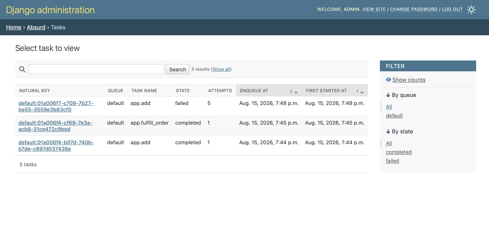
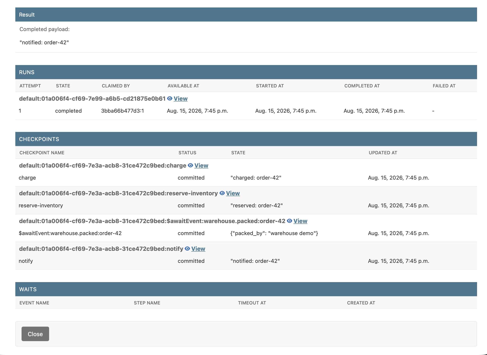
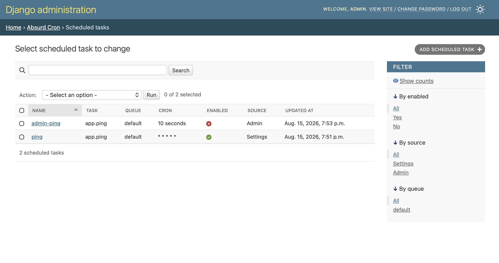

# Admin

With `django.contrib.admin` installed, every queue's tasks land in one changelist,
filterable by queue and state. Runs, Checkpoints, Events, Waits, and the Queues catalog
get their own alongside it.

- Read-only. There is no retry or cancel — the admin reports, it does not drive.
- A queue created only by an enqueue is not in the views yet, so its tasks do not
  appear. The changelist says so and names the queues — run
  `manage.py absurd_sync_queues` or start a worker on them.
- Toggle with `ENABLE_ADMIN`, or register on your own site with `ADMIN_SITE`
  ([Configuration](configuration.md#backend-options)).

## Trace a task

A task's own page carries the whole history inline: **Runs** is every attempt,
**Checkpoints** every committed [step](workflows.md#steps) — including a `$awaitEvent:`
entry per [event](workflows.md#events) awaited — and **Waits** whatever it is blocked on
right now.

- Each inline row links through to that run, checkpoint, or wait in full.

## Register schedules

[pg_cron](cron-jobs.md#postgres-side-pg_cron) schedules are the one writable surface.
Add one (name, task, cron — the rest resolves from the task's
[decorators](tasks.md#retries-spawn-options)), then change it to fill `args` / `kwargs`
and tick **Enabled**. Saving or deleting an enabled row (un)schedules its job at once.

- **Source** separates the two: `Settings` rows come from `SCHEDULE` and are read-only,
  `Admin` rows are yours to edit.
- `name` and the resolved options are frozen at create.
- `max_attempts` defaults to `5`; clearing it means retry forever.
- Writes bypassing `.save()` (data migrations, `bulk_create`, `update`, raw SQL) emit on
  the next [reconcile](cron-jobs.md#reconcile-without-migrating), not immediately.
- `loaddata` bypasses the router — pass `--database=<alias>`. Another database raises
  `NotImplementedError`.

→ [Django: the admin site](https://docs.djangoproject.com/en/6.0/ref/contrib/admin/).
